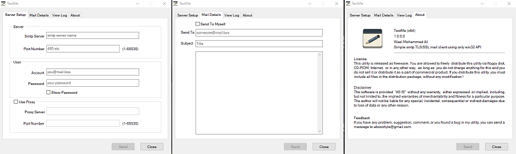

# TextMe

This is a simple SMTP TLS mail client implemented in C++.



## Features

- TLS mail client using pure win32 APIs
- Simple GUI interface using Dialog based window creation
- Easy to understand code structure (hopefully)

## Requirements

- C/C++ compiler I use mingw-w64ucrt [here](https://winlibs.com/)
- Make simply rename mingw32-make.exe to make.exe in ..GCCx64/bin.
- Resource editor I use [ResEdit](http://www.resedit.net) (look for mirrors if the link is broken).
- VS Code or any code editor of your choice.

## Installation

1. Clone the repository:
    ```sh
    git clone https://github.com/AboSohyle/TLSMail.git
    ```
2. Navigate to the project directory:
    ```sh
    cd TextMe
    ```
3. Compile the code:
    ```sh
    make release
    ```

## Usage

Run the executable:
```sh
./TLSMail.exe
```

## License

This project is licensed under the MIT License. See the [LICENSE](LICENSE) file for details.

## Contributing

Contributions are welcome! Please open an issue or submit a pull request.
